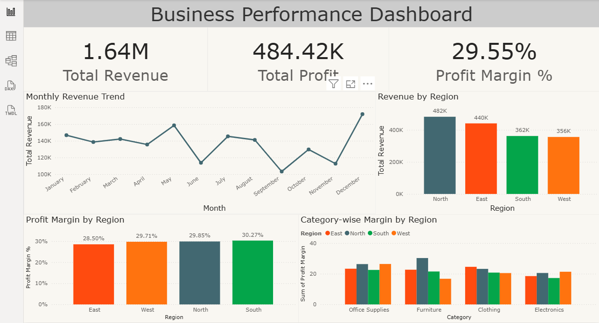

# Sales Performance Dashboard and Profitability Analysis

## Project Overview
This project analyzes sales data to evaluate business performance including revenue trends, profit margins, and regional sales distribution.

## Tools Used
- MySQL
- Excel
- Power BI

## Key Analysis
- Revenue and profit KPI analysis
- Regional sales performance
- Category-wise revenue contribution
- Monthly sales trend analysis

## Dashboard Features
- Total Revenue KPI
- Profit Margin KPI
- Regional Sales Analysis
- Category Performance Visualization
- Monthly Sales Trend

## Dataset
Sales dataset containing transaction-level business data used for analysis.

## Dashboard Preview

## Author
Nagendra V Sagar
